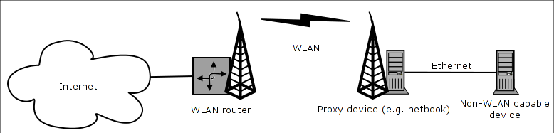

# WLAN_Kabel

Connecting a computer without WLAN to a WLAN access point

## Introduction

Wireless network clients don't have bridging capabilities, because the network adapter cannot change it's MAC-address. However, it is possible to »bridge« a single computer over Wireless, by not using the wireless adapter locally and forwarding all the packet to a destination computer.

WLAN_Kabel implements this use case. It allows to connect a computer without any Wireless adapters to a Wireless LAN using a »proxy« device, such as a netbook, equipped with both Ethernet and Wireless.

## Limitations

WLAN_Kabel will only work for one single network device. It will not work with multiple devices, not even with virtualized ones.

If you want to bridge multiple devices, you'll have to use 4addr mode on the WLAN device instead of WLAN_Kabel. However, in practise this is often not an option, because almost every AP will completely ignore any 4addr packets per default for security reasons. WLAN_Kabel, on the other hand, will work with every AP out of the box.

## Usage

You can compile WLAN_Kabel by just entering `make`. You will probably need make, a C-compiler and kernel headers installed.

To use WLAN_Kabel, you have to install it on the proxy device. Both the Wireless and the Ethernet adapter must be up, but not configured for any IP addresses. You can then start as root it like this:

`# ./wlan_kabel <wlan-adapter> <ethernet-adapter> <MAC of device to connect>`<Maximum Transfer Unit of network/host (Optional, default 1500)>

Example:

`# ./wlan_kabel wlan0 eth0 00:22:15:49:e5:55`
 # ./wlan_kabel wlan0 eth0 00:22:15:49:e5:55 1500

You can then connect your computer to the proxy device with a patch cable and bring it up normally - it will work with DHCP, etc.

WLAN_Kabel has been tested on:

-  ATH9K chipset with Ubuntu 10.10 
-  Ralink RT2870 on a Raspberry Pi

This fork:

- rtl8821ce-dkms with LightDM Distro: Linux Mint 21.1 Vera base: Ubuntu 22.04 jammy
- Intel(R) Ethernet Connection I217-LM with Windows 10 Pro Version:21H2

## Speed Test (This Fork)
1.
    19.21 down  (within expected range)
    0.12 up     (under expected range)
2.
    19.0 down   (within expected range)
    0.14 up     (under expected range)

## Changes Made By This Fork

Added another argument, Maximum Transfer Unit (MTU).
"send: Message too long"
This is a quick fix to prevent wlan_kabel from crashing due to the target device trying to upload packets larger than the MTU of the network/host device.
The new argument limits the packet size to prevent crashing from the target device trying to upload larger data packets.
The Download speed is unaffected but the upload speed is greatly lower in my tests from the original.

## License

You may use this code under the conditions of the GNU GPL v2 or later.

